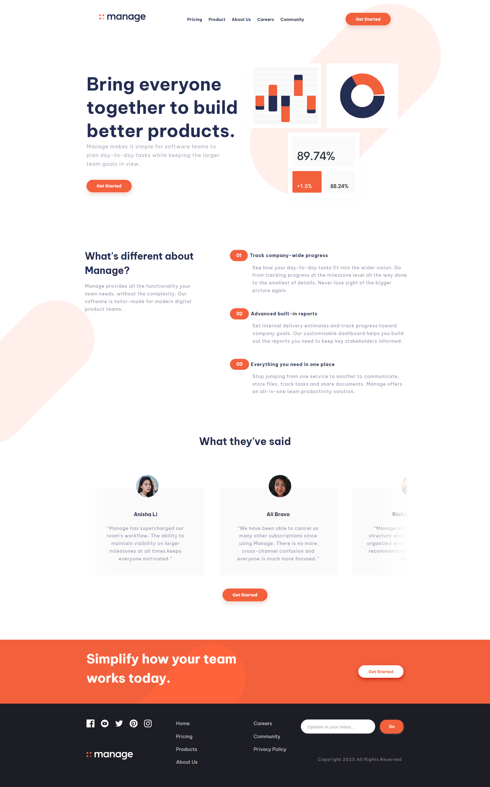
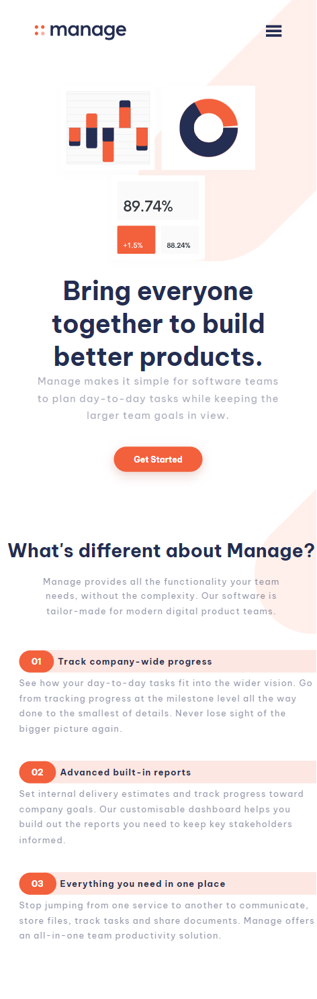
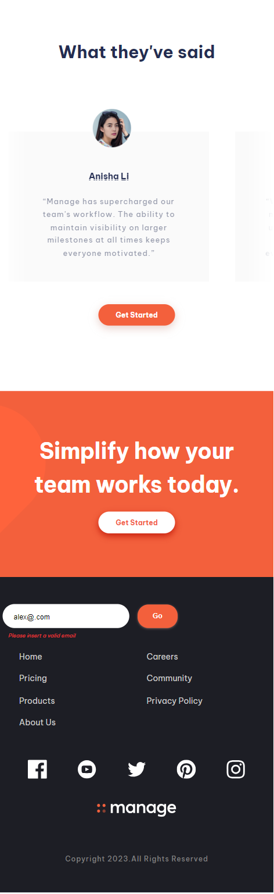
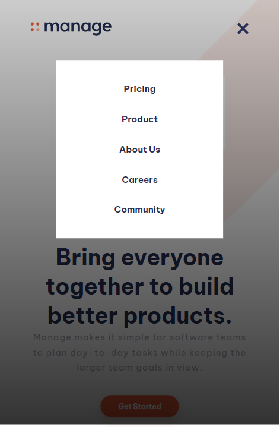

# Manage landing page solution

## Table of contents

- [Overview](#overview)
  - [The challenge](#the-challenge)
  - [Screenshot](#screenshot)
  - [Links](#links)
- [My process](#my-process)
  - [Built with](#built-with)
  - [What I learned](#what-i-learned)
  - [Continued development](#continued-development)
  - [Useful resources](#useful-resources)
- [Author](#author)
- [Acknowledgments](#acknowledgments)

## Overview

- Manage-Landing-Page Front-end Mentor Project

### The challenge

Users should be able to:

- View the optimal layout for the site depending on their device's screen size
- See hover states for all interactive elements on the page
- Recieve proper message when trying to type into the email input field.
- if the prefered-motion-reduce is on in the browser the scrolling animation is not applied.

### Screenshot

### Links

<!-- - Solution URL: [Add solution URL here](https://your-solution-url.com)
- Live Site URL: [Add live site URL here](https://your-live-site-url.com) -->

## My process

- Follwing mobile-first approach, i wrote the styles struct using css custome properties, (colors, Typography, spaces, etc...).
- When working with a bit complicated project, i like to devide my style sheet to a multiple sheets so it would be easier when the
  codes grow.

#### for example:

- styles.css contains the base styles.
- shared folder:

  - header.css
  - hero.css
  - features.css
  - testimonials.css
  - cta.css
  - learnMore.css
    after finishing the styling, i will combine all the sub-files into one (styles.css) main file.

- this also applies to javascrip.

### Built with

- Semantic HTML5 markup
- CSS custom properties
- Flexbox
- Mobile-first workflow
- Javascript

### What I learned

- Improved my CSS skills especially working with consesntance styling using css custome properties.
- Using javascript to cntrol the navigation bar toggeling.
- Creating infinite horizontal scrolling bar.

### Continued development

- IMPROVING MY CSS SKILLS, ADVANCED CSS CONCEPTS.
- USING JAVASCRIPT TO MANIPULATE THE DOM.

### Useful resources

- (https://developer.mozilla.org/en-US/docs/Learn/JavaScript) - The Official Documentation site for Javascript and CSS, helps when need more information when working with JS or CSS.

- (https://stackoverflow.co/) - A well-known website to find an answer to almost every question.

## Author

- DANIEL DENKHA
<!-- - Website - [Add your name here](https://www.your-site.com)
- Frontend Mentor - [@yourusername](https://www.frontendmentor.io/profile/yourusername)
- Twitter - [@yourusername](https://www.twitter.com/yourusername) -->

## Acknowledgments

- The Scrolling Animation for the Testimonial section was inspired by a brilliant teacher (KEVIN POWELL). BIG THANKS 🙂
